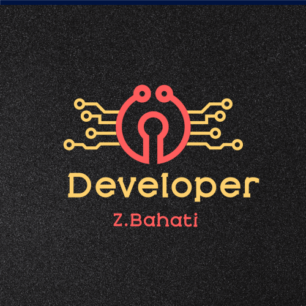

  <h3><b>React and Redux BookStore project</b></h3>

<!-- TABLE OF CONTENTS -->

# 📗 Table of Contents

- [📖 About the Project](#about-project)
  - [🛠 Built With](#built-with)
    - [Tech Stack](#tech-stack)
    - [Key Features](#key-features)
  - [🚀 Live Demo](#live-demo)
- [💻 Getting Started](#getting-started)
  - [Setup](#setup)
  - [Prerequisites](#prerequisites)
  - [Install](#install)
  - [Usage](#usage)
  - [Run tests](#run-tests)
  - [Deployment](#triangular_flag_on_post-deployment)
- [👥 Authors](#authors)
- [🔭 Future Features](#future-features)
- [🤝 Contributing](#contributing)
- [⭐️ Show your support](#support)
- [🙏 Acknowledgements](#acknowledgements)
- [❓ FAQ (OPTIONAL)](#faq)
- [📝 License](#license)

<!-- PROJECT DESCRIPTION -->

# 📖 [React bookStore project] 

**[Awesome books Project]**
  This project is a Bookstore website built using React and Redux Toolkit. The goal of this project is to create a fully functional online bookstore where users can browse and interact with a collection of books. Throughout the development process,we cover the following :
  1.Initialize project with components (React only)
  2.Add reducers and actions
  3.Use Redux in React components
  4.Connect to API
  5.Styling

  Throughout this project, I will gain hands-on experience with React, Redux Toolkit, and API integration. By the end of the project, I will have developed a fully functional Bookstore website that offers features such as book browsing and updating book information. This project will serve as a valuable demonstration of my skills and understanding of React and Redux Toolkit in building interactive web applications.

## 🛠 Built With 

### Tech Stack 

  
Client

  <ul>
    <li><a href="">HTML5</a></li>
    <li><a href="">CSS3</a></li>
    <li><a href="">React</a></li>
    <li><a href="">Redux toolKit</a></li>
    <li><a href="">Api</a></li>
  </ul>

  
Server

  <ul>
    <li><a href="">n/a</a></li>
  </ul>

Database

  <ul>
    <li><a href="/">n/a</a></li>
  </ul>

<!-- Features -->

### Key Features 

- **[use linters]**
- **[Displays a list of books]**
- **[Allows users to add new books to the list]**
- **[Allows users to remove books from the list]**
- **[Use API]**

(<a href="#readme-top">back to top</a>)

(<a href="#readme-top">back to top</a>)

<!-- GETTING STARTED -->

## 💻 Getting Started 

To get a local copy up and running, follow these steps.

### Prerequisites

In order to run this project you need:
- you need a laptop.
- you need github installed on it.
- You need a basic knowledge of Html and Css and JavaScript, and have Basic fondamental of React

### Setup

Clone this repository to your desired folder:

- git clone https://github.com/zbahati/BookStore-React.git
- cd my-folder

### Install

Install this project with:

- cd my-project
- npm install
- npm start to run the project to the browser

### Usage

To use the  BookStore React and Redux website, simply run  npm start command to the Command line of the currecnt directory then React will open the port and the render it to the Browser automatically the you can see the application runing on the browser

### Run tests

To run tests, run the following command:

- npx stylelint "**/*.{css,scss}" help to test styles error
- npx hint . help to test html error
- npx eslint . help to test jsx error in the react application

### Deployment

You can deploy this project using: github page's, or Render

(<a href="#readme-top">back to top</a>)

<!-- AUTHORS -->

## 👥 Authors 

👤 **Bahati zirimwabagabo**

- GitHub: [zbahati](https://github.com/zbahati)
- LinkedIn: [LinkedIn](https://www.linkedin.com/in/zirimwabagabo-bahati);
- Tweeter : [Twetter](https://twitter.com/b2_bahati);

(<a href="#readme-top">back to top</a>)

<!-- FUTURE FEATURES -->

## 🔭 Future Features 

- [ ] **[Nav menu toggle on mobile devices]**
- [ ] **[Add server]**
- [ ] **[Add books to the Cart]**

(<a href="#readme-top">back to top</a>)

<!-- CONTRIBUTING -->

## 🤝 Contributing 

Contributions, issues, and feature requests are welcome!

(<a href="#readme-top">back to top</a>)

<!-- SUPPORT -->

## ⭐️ Show your support 

show me your support by following me on github and giving me a star please .

(<a href="#readme-top">back to top</a>)

<!-- ACKNOWLEDGEMENTS -->

## 🙏 Acknowledgments <a name="acknowledgements">Microverse</a>

1.I would like to thank Microverse for guidance and support in this project and always. 
2.A big thanks goes to USMAN SULEIMAN BABAKOLO who give the UI inspiration to create this BookStore project using his UI.

(<a href="#readme-top">back to top</a>)

(<a href="#readme-top">back to top</a>)

<!-- LICENSE -->

## 📝 License 
This project is [MIT](./license.md) licensed.

(<a href="#readme-top">back to top</a>)

